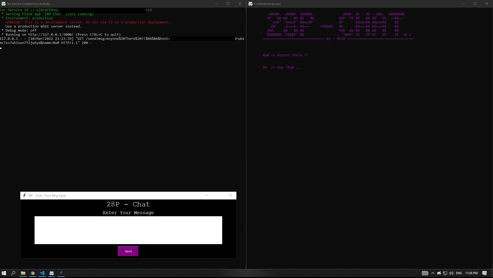
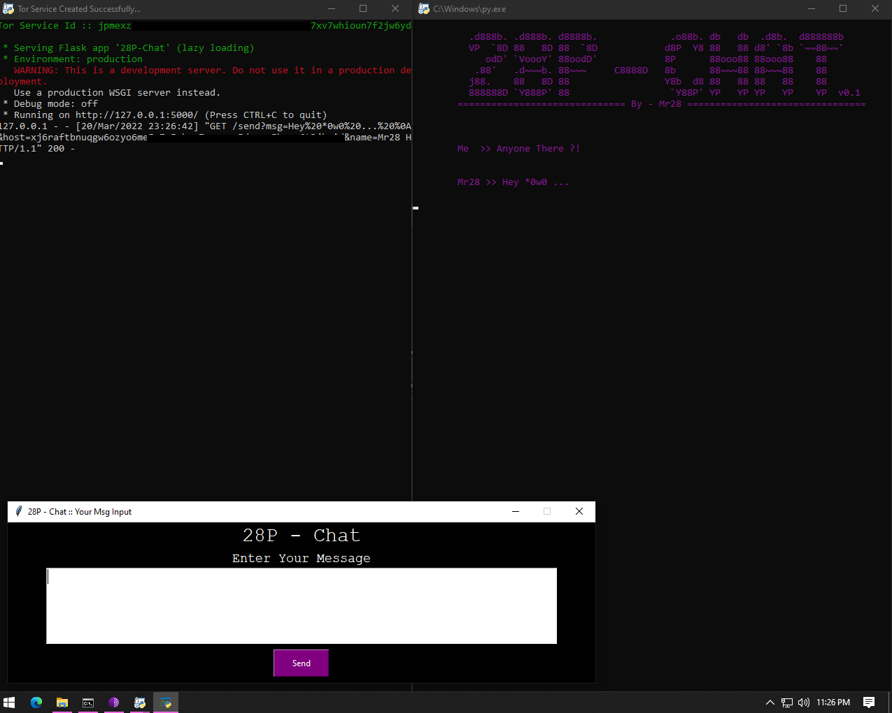

# 28P-Chat  v0.2
[](https://www.python.org/)


#### Description
```
peer to peer chat on tor service
```
####  

#### Used libraries :
```requests-tor ,cryptography ,tkinter ,torpy ,stem ,flask ,getpass ,argparse ```

#### Download Binary (portable) : [Link](https://cdn.discordapp.com/attachments/943776213724463114/955260201831899186/28P-CHAT.rar)

###### ============================ Configure ============================

### first run : run.py 

##### ========== Commands ==========

<br>

```
[--c] --conf
[--r] --reconfig
[--p] --peerhost
```

### run.py  --conf
##### `this will show your data like : name,password hash, your host,peer host.....`

### run.py  --reconfig
##### `this will reset your data`

### run.py  --peerhost  "set your Friend tor host here"
##### `This will update the host you are talking to`
``` 
without http:// and .onion .... so if i have this addr : 
http://juhanurmihxlp77nkq76byazcldy2hlmovfu2epvl5ankdibsot4csyd.onion
it's will be like this :
juhanurmihxlp77nkq76byazcldy2hlmovfu2epvl5ankdibsot4csyd
```
##### like : ` run.py  --peerhost "juhanurmihxlp77nkq76byazcldy2hlmovfu2epvl5ankdibsot4csyd"


##### PC No.1 [ User : Me ]


##### PC No.2 [ User : 0w0]



